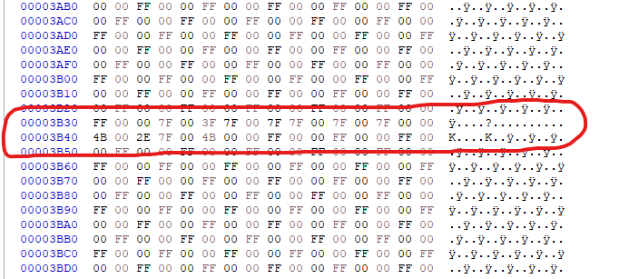

# DAY1 무지개 만들기

----------------------------

#### 0단계 재료와 라이브러리 준비

원본파일 준비
[원본](files/red_FF0000(OG).bmp)

* 라이브러리 준비
* [다운로드 링크](../.github/assets/HxD%20-%20Freeware%20Hex%20Editor%20and%20Disk%20Editor%20-%20mh-nexus.url)

----------------------------------------

#### 1단계 무지개 RGB갋 정하기

1.   빨강:127 0 0
2.   주황:127 63 0
3.   노랑:127 127 0
4.   초록:0 127 0
5.   파랑:0 0 127
6.   자주색:46 0 75
7.   보라색:75 0 127

#### 2단계 16진수로 바꾸기

1.   빨강:00 00 7F
2.   주황:00 3F 7F
3.   노랑:00 7F 7F
4.   초록:00 7F 00
5.   파랑:7F 00 00
6.   자주색:4B 00 2E
7.   보라색:7F 00 4B

--------------------------------------

#### 3단계 위치 정하기

먼저 무지개가 있어야 할 위치를 잡아야 하는데..

###### 이미지의 중간 찾기  

1. HxD 멘 윗줄 칸 보기
2. 윗줄 해석

그다음 1단게와 2단게를 시행하였습니다.

위 사진에 보이는 대로 1단계와 2단계를 모두 시행한 뒤 모습입니다.

---------------------------------------

#### 결과입니다
   (크기가 작으니 이미지를 클릭해 주세요)

